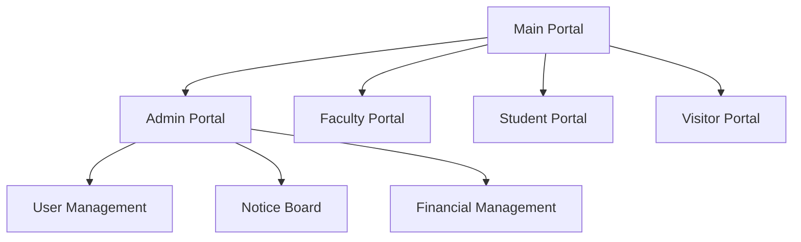

# 🎓 Educational Institution Portal System
<div align="center">


[](https://opensource.org/licenses/MIT)
[](http://makeapullrequest.com)
[](https://github.com/username/educational-portal/graphs/commit-activity)

</div>

## 🌟 Features

<details>
<summary>🔐 Multi-Portal Access System</summary>

- **Admin Portal** - Complete institutional management
- **Faculty Portal** - Teaching staff interface
- **Student Portal** - Student management system
- **Visitor Portal** - Public information access
</details>

<details>
<summary>👩‍💼 Administrative Features</summary>

- User Management (Faculty & Students)
- Notice Board Management
- Financial Management
- Real-time Updates
</details>

<details>
<summary>📚 Academic Features</summary>

- Personal Dashboards
- Notice Board Access
- Financial Information
- Profile Management
</details>

## 🚀 Quick Start

1. **Clone the repository**
   ```bash
   https://github.com/rajtilak-2020/Institution-Robot-UI.git
   ```

2. **Install dependencies**
   ```bash
   npm install
   ```

3. **Start the development server**
   ```bash
   npm run dev
   ```

## 🔑 Default Credentials

```javascript
Admin Portal:
ID: admin
Password: admin1

Faculty/Student Portal:
- Use registered ID (minimum 6 characters)
```

## 💻 Portal Features

### 🔐 Admin Portal
- User Management
  - Add/Edit/Remove Faculty
  - Add/Edit/Remove Students
- Notice Management
  - Post Announcements
  - Target Specific User Groups
- Financial Management
  - Manage Faculty Salaries
  - Track Student Fees

### 👩‍🏫 Faculty Portal
- View Personal Information
- Check Salary Details
- Access Notice Board
- Interactive Dashboard

### 👨‍🎓 Student Portal
- Personal Dashboard
- Fee Information
- Notice Board Access
- Academic Updates

### 🌐 Visitor Portal
- Institution Information
- Public Announcements
- Admission Queries
- Campus Information

## 🎨 Technologies Used

<div align="center">


</div>

## 🔧 System Architecture



## 📱 Responsive Design

The portal is fully responsive and works seamlessly across:
- 💻 Desktop Computers
- 📱 Tablets
   

## 🔒 Security Features

- Secure Authentication System
- Role-based Access Control
- Session Management
- Data Encryption
- Input Validation

## 🎯 Future Enhancements

- [ ] Real-time Chat System
- [ ] Online Assignment Submission
- [ ] Attendance Management
- [ ] Grade Management System
- [ ] Online Payment Integration

## 🤝 Contributing

Contributions are welcome! Please feel free to submit a Pull Request.

1. Fork the Project
2. Create your Feature Branch (`git checkout -b feature/AmazingFeature`)
3. Commit your Changes (`git commit -m 'Add some AmazingFeature'`)
4. Push to the Branch (`git push origin feature/AmazingFeature`)
5. Open a Pull Request

## 📄 License

This project is licensed under the MIT License - see the [LICENSE](LICENSE) file for details.

## 📞 Contact

For any queries or support, please contact:

- Email: rajtilak1062020@gmailcom
- Linkedin: krajtilak2020

---

<div align="center">

<p align="center">
    Made with ❤️ by <a href="https://github.com/rajtilak-2020">Raj</a>
</p>


</div>
